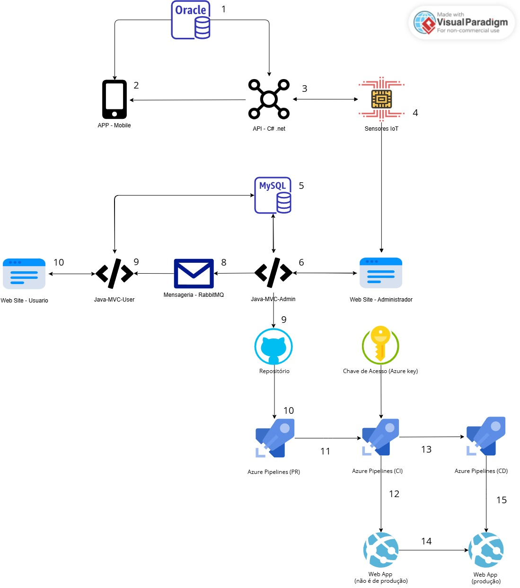

# 🚨 Projeto Alerta SP

## 👥 Equipe do Projeto

| Matrícula  | Nome                             |
|------------|----------------------------------|
| **553568** | Sabrina da Motta Café            |
| **552692** | Luís Henrique Oliveira Da Silva |
| **554199** | Matheus Duarte Oliveira         |

## 📌 Descrição Geral

O **Alerta SP** é um sistema inteligente de monitoramento em tempo real, focado na prevenção e alerta sobre enchentes e desastres naturais. Utiliza sensores IoT instalados em áreas de risco para coletar dados de nível dos córregos e gerar alertas em caso de perigo. O painel administrativo em Java permite acompanhar as leituras, registrar valores manualmente e gerar relatórios automatizados com auxílio de IA.


Link Vídeo: https://youtu.be/x3Pc_qOISF8

Link Vídeo Pitch: https://www.youtube.com/watch?v=x8Oygxk1--8

Link do WebApp: https://alertasp-java-rm553568.azurewebsites.net/home

Usuario: admin

senha: admin123

---

## 🏗️ Arquitetura do Sistema



**Legenda:**
1. **Banco de Dados Oracle**: Armazena dados do app móvel (usuários, alertas, favoritos, denúncias).
2. **Aplicativo Mobile**: Interface para usuários finais verem alertas, cadastrar locais e enviar denúncias.
3. **API RESTful (C# .NET)**: Comunicação central entre sensores IoT, app móvel e BD Oracle.
4. **Sensor IoT**: Dispositivos que monitoram nível da água e enviam dados para análise.
5. **Banco de Dados MySQL (Azure)**: Armazena córregos, sensores, leituras históricas e configurações administrativas.
6. **Aplicação Java MVC Admin**: Gestão administrativa (cadastro de córregos, sensores, leituras, alertas).
7. **Web Site – Administrador**: Dashboard gráfico para gestores dispararem alertas e ajustes.
8. **Mensageria – RabbitMQ**: Comunicação assíncrona entre módulos (painel admin e usuário).
9. **Código-fonte no GitHub**: Versionamento e integração com pipelines automatizados.
10. **Pipeline de Pull Request (PR)**: Linting, build e testes rápidos antes de merge.
11. **Pipeline CI + Release**: Empacotamento, geração de artefato e Release no Azure Pipelines.
12. **Homologação**: Deploy em ambiente de QA no Azure App Service (pré-produção).
13. **Aprovação para Produção**: Gatilho manual/automático após validações.
14. **Deploy em Produção**: Atualização do Web App de produção.

---

## ⚙️ Configuração do Banco MySQL no Azure

- **Grupo de Recursos:** `alertaSP-mysql-rg`
- **Nome do Servidor:** `servidor-alertasp-mysql`
- **Logon do Administrador:** `adminAlertaSp`
- **Senha:** `Alertasp@rm553568`

```text
Hostname: servidor-alertasp-mysql.mysql.database.azure.com
Port:     3306
Username: adminAlertaSp@alertasp-mysql
Password: Alertasp@rm553568
````

> **Configuração de Conexão no App Service:**
>
> * **Nome:** `MYSQLCONNSTR_DefaultConnection`
> * **Valor:** `jdbc:mysql://alertasp-mysql.mysql.database.azure.com:3306/alerta_sp?useSSL=true&requireSSL=true&serverTimezone=UTC`

---

## 🚀 CI/CD: Azure Pipelines

O arquivo abaixo (`azure-pipelines.yml`) define os estágios de Infraestrutura, Build e Deploy.

```yaml
trigger:
  branches:
    include:
      - main
      - master

pool:
  vmImage: "ubuntu-latest"

variables:
  - name: rm
    value: rm553568
  - name: location
    value: brazilsouth
  - name: resourceGroup
    value: alertaSP-Java-rm553568-rg
  - name: service-plan
    value: asp-alertaSP-Java-rm553568
  - name: app-name
    value: alertaSP-Java-rm553568
  - name: runtime
    value: JAVA|17-java17
  - name: sku
    value: F1
  - name: nome-artefato
    value: alertaSP

stages:
  # -------------------- INFRA -----------------------
- stage: CriarInfra
  jobs:
    - job: criaWebApp
      displayName: Criar ou atualizar o Serviço de Aplicativo
      steps:
        - task: AzureCLI@2
          inputs:
            azureSubscription: 'Azure for Students (035f5616-432c-454b-b3f6-52a1f6a8b17b)'
            scriptType: 'bash'
            scriptLocation: 'inlineScript'
            inlineScript: |
              echo "Criando Resource Group (se necessário)..."
              az group create --location $(location) --name $(resourceGroup)

              echo "Criando App Service Plan (se necessário)..."
              az appservice plan create -g $(resourceGroup) -n $(service-plan) --is-linux --sku $(sku) || true

              echo "Criando Web App (se necessário)..."
              az webapp create -g $(resourceGroup) -p $(service-plan) -n $(app-name) --runtime "$(runtime)" || true

              echo "Configurando variável de ambiente PORT=8080..."
              az webapp config appsettings set \
                --name $(app-name) \
                --resource-group $(resourceGroup) \
                --settings PORT=8080

# -------------------- BUILD -----------------------
- stage: BuildApp
  jobs:
    - job: buildWebApp
      displayName: Realizar o Build da aplicação
      steps:
        - task: Maven@4
          displayName: 'Build alertaSP'
          inputs:
            mavenPomFile: 'mvc-admin/pom.xml'
            mavenOptions: '-Xmx3072m'
            jdkVersionOption: 1.17
            goals: 'package'
            publishJUnitResults: true
            testResultsFiles: '**/surefire-reports/TEST-*.xml'

        - task: CopyFiles@2
          displayName: 'Copiar JAR gerado'
          inputs:
            SourceFolder: '$(System.DefaultWorkingDirectory)/mvc-admin'
            Contents: '**/target/*.jar'
            TargetFolder: '$(Build.ArtifactStagingDirectory)'

        - task: PublishBuildArtifacts@1
          displayName: 'Publicar artefato alertaSP'
          inputs:
            PathtoPublish: '$(Build.ArtifactStagingDirectory)'
            ArtifactName: $(nome-artefato)

# -------------------- DEPLOY -----------------------
- stage: DeployApp
  dependsOn: BuildApp
  jobs:
    - job: DeployWebApp
      displayName: Realizar Deploy no Azure App Service
      steps:
        - task: DownloadBuildArtifacts@1
          displayName: 'Baixar artefato'
          inputs:
            buildType: 'current'
            downloadType: 'single'
            artifactName: '$(nome-artefato)'
            downloadPath: '$(System.DefaultWorkingDirectory)/$(nome-artefato)'

        - task: AzureRmWebAppDeployment@4
          displayName: 'Deploy alertaSP JAR'
          inputs:
            azureSubscription: 'Azure for Students (035f5616-432c-454b-b3f6-52a1f6a8b17b)'
            appType: 'webAppLinux'
            WebAppName: $(app-name)
            packageForLinux: '$(System.DefaultWorkingDirectory)/$(nome-artefato)/**/*.jar'
```

### Explicação dos Trechos

* **trigger:** Define os branches (`main`, `master`) que disparam a pipeline automaticamente.

* **pool:** Seleciona a imagem de build (`ubuntu-latest`).

* **variables:** Variáveis reutilizáveis (nomes de recursos, planos e configurações).

* **Stage CriarInfra:** Cria (ou atualiza) o Resource Group, App Service Plan e Web App via Azure CLI; configura a porta 8080.

* **Stage BuildApp:** Executa o build Maven do projeto Spring MVC; copia e publica o artefato gerado (JAR).

* **Stage DeployApp:** Baixa o artefato publicado e faz o deploy no Azure App Service Linux.

---
